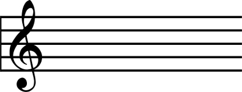

# Motivación e introducción

### Bandas de música y su problema

Los directores de orquesta tienen como función la de guiar a los intérpretes de dicho grupo en la interpretación de las distintas composiciones (ya sea para realizar correcciones durante los ensayos, elegir qué obras integrar en el repertorio, aportar un punto de expresividad en la entonación...). 

Sin embargo, durante un concierto hay un cometido elemental: otorgar unidad entre los instrumentos (señalar para que todos los músicos sigan el mismo ritmo -y mantener dicha velocidad durante toda la obra-, por ejemplo).

A esto hay que añadirle la dificultad que se presenta cuando bandas de música, profesionales o no, realizan algún tipo de desfile o pasacalles donde el director no está visible a todos los músicos y, por tanto, la tarea descrita anteriormente se hace muy difícil o imposible de llevar a cabo.

Este trabajo se centrará en tratar de remediar la problemática que genera este inconveniente.

### Soluciones actuales

Estas asociaciones tienen, como principal solución a este problema, la utilización metrónomos durante los ensayos y, al actuar en la calle, tratar de conseguir el mismo resultado. 

Con el despegue de los teléfonos inteligentes, han aparecido múltiples aplicaciones que hacen las veces de metrónomo (incluso, algunas son capaces de calcular el “tempo” -término que se verá con más detenimiento después- a partir de las pulsaciones que haga el usuario sobre un botón -y dichas pulsaciones se deberán hacer al ritmo que vaya la música-). 

Por otro lado, los compositores han introducido algún tipo de percusión a sus obras con la finalidad de favorecer el acompasamiento entre todos los instrumentos (además de añadir un instrumento que ayude a enriquecerla). Si unimos estos dos hechos, instalando una aplicación de esta naturaleza en un teléfono móvil y éste a su vez en un soporte para un instrumento de percusión, podríamos mantener la velocidad de interpretación durante la actuación con un coste relativamente bajo (aunque se mantiene la velocidad en el punto de referencia -que al no ser un computador, estará sujeto a errores-, no se consigue solucionar totalmente la descoordinación entre los músicos).

### Conceptos previos necesarios

Para poder entender algunos conceptos que se usarán a lo largo de este trabajo y hablar con propiedad en cuanto a algunos conceptos, es necesario tener unos conocimientos musicales mínimos. Se procede a definir algunos conceptos:

* Pentagrama: es el conjunto formado por cinco líneas paralelas entre sí y los cuatro espacios que quedan entre ellas. Aunque también puede haber líneas adicionales por encima y por debajo del pentagrama, principalmente se usan estas cinco líneas y espacios para escribir los símbolos musicales (ya sean notas, silencios...).

Representación gráfica de un pentagrama

* Pulso: es el latido constante y regular de la música, siendo la unidad temporal básica y, en comparación con esta unidad de tiempo, se mide la duración de las notas y silencios. 

* “Tempo”: es la velocidad del pulso. Para indicar un tempo se utiliza como unidad los “bpm” (“Beats Per Minute”, es decir, los “Pulsos Por Minuto”). Así, si el tempo de una obra es de 60 bpm, tendremos que se producirá un pulso por segundo (1 bps) o lo que es lo mismo, cada un segundo, tendremos un pulso.
* Ritmo: es la combinación de sonidos y silencios de diferente duración.

* Compás: facilita la lectura de la música. En un pentagrama, los compases quedan divididos por líneas divisorias. Tomaremos que todos los compases son cuaternarios de subdivisión binaria (la mayoría de las obras para banda de música se encuentran compuestas para este tipo de compases o binarios -encajables en los anteriores- y así podremos simplificar el problema para su estudio), es decir, un compás está dividido en cuatro notas negras (cada una será de un pulso de duración).

Un pentagrama con compases cuaternarios de subdivisión binaria

En la anterior imagen podemos ver un pentagrama con compases cuaternarios de subdivisión binaria. El símbolo al principio de pentagrama con forma de “C” es llamado “compasillo” y es lo mismo que poner 4/4 (indicando el tipo de compases que van a seguir). 

Para comprender cuántas notas caben por cada uno de estos compases, se ha realizado la siguiente tabla (donde 4/4 sería completar el compás).

| Nota          | Figura                             | Tiempo       |
| ------------- | -----------------------------------|------------- |
| Redonda       |      |1/4           |
| Blanca        |       |2/4           |
| Negra         |        |4/4           |
| Corchea       |      |1/8           |
| Semicorchea   |  |1/16          |
| Fusa          |         |1/32          |
| Semifusa      |     |1/64          |

Y sus correspondientes silencios, que no se mostrarán debido a que no es finalidad de esta memoria realizar un estudio sobre música, pero que el lector puede consultar en la bibliografía.

Producto a desarrollar
Teniendo en cuenta todo lo dicho en las anteriores páginas, es el momento de manifestar el dispositivo que se desea desarrollar en este trabajo:
un dispositivo que marque el pulso (que no el ritmo, al poder ser éste irregular mientras que el pulso es constante) en función del “tempo” que indique el director de la agrupación. Además, el sistema deberá ser discreto ya que se busca que las bandas lo utilicen principalmente en la calle.

Esta necesidad por parte de las bandas de música ha sido detectada por algunos fabricantes, como Peterson, que puso a la venta un producto llamado “Body Beat”. Dispone de un amplio abanico de funciones pero su tamaño y su elevado coste hacen inviable la implantación del sistema en una banda de música (hay que tener en cuenta que el número de componentes en una banda es variable pero ronda entre los 50 y 100 músicos -algunas de ellas sobrepasan este número, como la “Banda de Cornetas y Tambores Nuestra Señora de la Victoria” conocida como “Las Cigarreras” de Sevilla que, en las fechas en las que se escribe este trabajo, ronda los 140 componentes-. Por otro lado, las dimensiones, de unos 10.8 cm x 7.6 cm x 2.54 cm puede que sean demasiado grandes). Como último escollo, muchos son los usuarios que, a través de la red, se quejan de la corta duración de la batería (teniendo en cuenta que hay actuaciones que pueden llegar a durar entre 8 y 10 horas, esto es un problema importante).

Un dispositivo más barato con un número menor de funciones pero que permita la sincronización de todos los dispositivos y mantener el tempo durante toda la interpretación, atraería más usuarios. Si además se procura que la construcción se haga utilizando software y hardware libre, podría crearse una comunidad de desarrolladores en torno al producto, consiguiendo mejorar la calidad del dispositivo y aumentar la funcionalidad de este.

## Resumen

En el presente trabajo, el lector podrá encontrar cómo se ha desarrollado un sistema wearable que, mediante vibración, facilita a los intérpretes de una banda de música seguir el mismo tempo. De esta forma, se ayudará a que todos los miembros del conjunto sigan el mismo pulso y puedan mantenerlo constante durante toda la ejecución.

Esta necesidad ha despertado el interés de algunas compañías, que han desarrollado como el llamado “Body Beat”, de la marca “Peterson” que, a pesar de su gran abanico de funciones, no ha tenido el éxito esperado en el mercado al tener elevado coste. Un sistema que hiciese las veces de metrónomo wireless (característica principal y más atrayente del artículo antes mencionado) a un precio menor atraería a muchos más clientes.

Para que todos los integrantes de la agrupación puedan llevar el mismo pulso, se ha creado una red inalámbrica de sensores (WSN) que permite la sincronización de los aparatos que portan todos los músicos. La red de sensores ha sido concebida utilizando la implementación de ZigBee propuesta por la empresa “Digi International”, mientras la lógica de los circuitos se ha puesto en manos de la plataforma hardware Arduino (utilizándose diversas versiones del mismo).

El tipo de red que forman los dispositivos XBee ZigBee es de tipo malla pero, utilizando la configuración de las motas, se ha pasado a tener una topología de estrella. Dispone de dos tipos de wearables:

* Director: su mota juega el papel de “coordinador” de la red. Es quien crea la red y establece los caminos que deben seguir las comunicaciones que haya en la red. Además de la comunicación con los otros elementos del sistema, tiene la opción de conectar, a través de Bluetooth, con un dispositivo Android. 
* Músico: contiene una mota del tipo “dispositivo final”. Simplemente, recibe (del dispositivo “director”) el tempo con el que el micromotor vibrador debe activarse (además, al llegar el paquete con la traza de datos, se sincroniza con el resto de dispositivos de la red, de forma que todos vibren a la vez).

Como se comentaba cuando se hablaba del dispositivo del director, se puede conectar con un dispositivo móvil Android. Es necesario que el director indique el tempo que el sistema debe marcar a los músicos, esta aplicación móvil es la que transfiere al controlador la velocidad a la que debe compaginar a los intérpretes (para evitar sobrecargar la red, se hace una coordinación cada cierto tiempo -por si hubiera habido retrasos en la organización inicial- y cada dispositivo subdivide en función del tempo que se le ha enviado). Buscando facilitar al usuario la utilización de esta tecnología, se ha desarrollado tanto una aplicación para teléfonos móviles, como para smartwatches que funcionen con el sistema operativo Android Wear.

Una vez desarrollada la base del sistema, es posible crear nuevas funcionalidades como la instalación de un sensor de vibración que permita a los percusionistas obtener retroalimentación para saber si los intérpretes están ejecutando la partitura siguiendo el tiempo marcado o la posibilidad de pasar lista (conociendo qué sensores se encuentran activos en la red).

##### Palabras clave

ZigBee, Metrónomo, Arduino, WSN, Xbee, Android

## Resumen en inglés

One of the principles of engineering is creating solutions to the problems of users. In this dissertation, the reader will be able to find how a wearable system has been developed helping musicians to go on the same “tempo” through vibration while they are playing music. This device sends the same pulse to all musicians and keep the “tempo” constant.

Some companies have developed similar systems. For example, Peterson created an item called “Body Beat”. It has a big range of functions and odds but it is too expensive for the majority of musicians. One device cheaper than only with synchronization functions (the most important ability of this system) could attract more buyers. Furthermore, to create a free and open hardware platform could interest other developers to improve the functionality of this product (helping musicians, music teachers and other music professionals to play music with a better quality).

All music band’s components need to have the same pulse (if each instrumentalist had a different pulse, each one would read his score in a different speed and it would be a problem). It is possible because it has been created using a wireless sensor network (they enable communication with a very low energy cost). Then, when all nodes are synchronized, they know when they have to start the vibrations. But they do not have to be vibrating all time. They have to vibrate constantly as many times as the director said (for example, if compasses are of 4/4 and tempo 60 bpm -Beats Per Minute-, each node will vibrate 1 time per second).

This network has been deployed using ZigBee implementation of the “Digi International” company. Also, circuit logic has been put into operation using the hardware platform called Arduino (various versions of this, like Arduino Lilypad, Arduino Uno or Arduino Leonardo).

In the following pages , it is explained in more detail why certain decisions have been taken (some experiments in time between node's communications, explanations about XBee communication packets...)

XBee Zigbee’s devices are organized in mesh network but, changing each node’s configuration, we have now a network with star topology. There are two kinds of wearables:
Music director: it is the coordinator of network. It is who start the network and establish the paths of communication packets between all nodes. In addition, it is able to send data to every node and receive data from an Android device via Bluetooth. Only one in each network.
Musician: it is composed of an “end device” node. It receives (from “music director device”) data (which contains “tempo”). Arduino takes this tempo and performs calculations to decide when it has to activate or deactivate a vibration motor (this motor helps musician to keep track of the correct pulse). There is one for each musician (in network, there will be as nodes as musicians).

* Director’s device can be connected to an Android device (which could be a smartphone or a smartwatch, because one application has been developed to each one). This application allows director to indicate music’s “tempo” and each application was developed using Google’s recommendations about design (Material Design principles).

* Taking this base, it is possible to create new functions such as installing a vibration sensors in drums to measure the tempo of the band and provide a feedback to the director. Another possibility could be rollcalling at the band (only it is necessary show what nodes are in the network at the moment).

##### Palabras clave

ZigBee, Metronome, Arduino, WSN, Xbee, Android

## Objetivos 

El objetivo de este proyecto, como ya se ha manifestado en el resumen, es la de crear un dispositivo hardware que permita a los componentes de una banda de música seguir el mismo pulso (y de forma constante) durante la ejecución de una obra.

Los principales objetivos a alcanzar con este desarrollo son:
* Que el sistema sea wireless: se quiere realizar la sincronización entre los dispositivos que portan los músicos sin utilizar una conexión física entre ellos
* Conseguir un precio menor que otras soluciones del mercado: utilizando una tecnología distinta a la que han usado otros productos, tratar de obtener un sistema con un menor costo
* Escalable en el número de dispositivos: el sistema no debe verse resentido con el aumento del número de dispositivos en la red
* Ampliable en funciones: posibilidad de desarrollar nuevas funcionalidades partiendo de la red de sensores
* Vestible: debe ser un sistema discreto y cómodo para el portador
* Bajo consumo energético: debido a que hay actuaciones que pueden durar varias horas, es necesario que el sistema consuma poca energía para evitar agotar la fuente de alimentación
* Tecnología lo más libre posible: se desea utilizar herramientas libres para tratar de atraer al mayor número de desarrolladores posible. Además por la propia naturaleza del software/hardware libre, la comunidad aportará parches y soluciones a los problemas que puedan presentarse, mejorando la calidad del desarrollo
* Suficiente para cubrir las necesidades del mercado: aunque anteriormente se mencionaba que se desea que el sistema sea ampliable en funciones, es también necesario que la versión inicial tenga unas funciones mínimas que permitan cubrir las necesidades básicas del mercado

Como objetivos secundarios:
* Utilizar diversas versiones de la plataforma hardware Arduino: se tiene como objetivo utilizar distintas versiones de Arduino para poder obtener el producto con distintos formatos (Arduino Lilypad, Arduino Uno...)
* Desarrollar una red inalámbrica de sensores: teniendo en cuenta la actual dirección de la industria respecto a este tipo de tecnología (su aplicación, por ejemplo. en el “Internet de las Cosas”), es interesante trabajar con esta tecnología
* Crear un dispositivo wearable: actualmente es uno de los sectores en los que más están trabajando las compañías. Si miramos la curva de Gatner [X], en el año 2014 estas tecnologías se situaban en la cima del ciclo.

Hay que destacar entre los aspectos formativos previos más utilizados para el desarrollo del proyecto los conocimientos adquiridos a lo largo del grado sobre ingeniería del software (para establecer los requisitos, planificación y costes del desarrollo), programación de dispositivos móviles y alguna formación en desarrollo de dispositivos hardware.

# Desarrollo

## Solución general propuesta

El dispositivo que se desea desarrollar tiene que hacer la función básica del director de la banda de música durante una actuación, es decir, marcar el mismo pulso a los músicos.

Cuando la agrupación se encuentra realizando un concierto, el esquema de comunicación que se sigue es el siguiente (donde el nodo rojo es el director y lo morados los músicos):

Esquema de comunicación director-músico

Hay que aclarar que en este caso, para simplificar, sólo se han dibujado 5 músicos, sin embargo, como se vio en la introducción, las bandas suelen contar entre sus filas con varias decenas de integrantes.

Es preciso establecer comunicación entre los músicos y el director así que será fundamental la creación de una red. Como podemos observar, el esquema es el mismo que el de una red en estrella. Cuando llevemos esta misma situación a una actuación en la calle, la topología será la misma (un nodo hará las veces de maestro y el resto de esclavos).

Se van a desarrollar pues, dos dispositivos:
* Dispositivo director: enviará el pulso a los otros nodos
* Dispositivo músico: recibirá el pulso y, mediante un actuador, lo informará al intérprete

En los siguientes apartados se irán viendo las tecnologías propuestas y cómo se ha implementado el sistema.

## Tecnologías a utilizar

### Creación de la red: WSN

Para crear la red se va a optar por formar una red inalámbrica de sensores ya que es el tipo de infraestructura que cumple con las necesidades del sistema a desarrollar. 

Una red inalámbrica de sensores (WSN, Wireless Sensor Network) es aquella formada por un conjunto de elementos autónomos cuyo objetivo es el de solucionar una tarea utilizando comunicación inalámbrica. Los nodos que forman la red no disponen de alta capacidad funcional y tienen un costo energético bajo (siendo posible su alimentación a través de baterías).

#### Método a utilizar

Dentro de las WSN, podemos elegir entre distintos métodos para realizar la comunicación entre nuestras motas. Según las necesidades que tenga nuestra red, utilizaremos uno u otro. Se van a analizar brevemente algunos de los principales:

* WiFi: basado en el estándar IEEE 802.11. Alta velocidad en transferencia de datos (permite adaptación a la velocidad de transmisión), seguridad en la red pero no dispone de mecanismos para ahorrar energía.
* Bluetooth: otro estándar de comunicación entre dispositivos. Permite broadcast, una velocidad de hasta 24Mbit/s y sus redes son de hasta 8 nodos (uno maestro y siete esclavos). En la versión 4 se han introducido métodos para reducir el consumo de energía.
* 802.15.4: es un estándar propuesto por el IEEE. El ancho de banda es muy pequeño, la latencia se sitúa en torno a los 15ms, alcance de entre 10 y 20 metros, permite tener miles de nodos en la red, mecanismos para tener un bajísimo consumo de energía y barato.
* ZigBee: es un estándar desarrollado sobre 802.15.4, lo que quiere decir que añade capas a la propuesta hecha en 802.15.4 (añadiendo algunas funciones).

Todos estos métodos permiten la topología en estrella (en párrafos anteriores se explicó por qué se utiliza para el desarrollo del ingenio). 

Teniendo en cuenta el análisis anterior se concluye que

* WiFi queda descartado: aunque existan redes de sensores que utilicen esta tecnología, WiFi no contempla mecanismos para el ahorro de energía. Aunque vaya a ser necesaria una alta velocidad (debido a los requisitos temporales del sistema), no hace falta tanta como la que proporciona este mecanismo de comunicación (por lo que se vería desperdiciada)
* Bluetooth se descarta: a través de la capa de aplicación, algunas implementaciones de redes inalámbricas de sensores han conseguido aumentar el número máximo de nodos por red. Por otra parte, aunque la versión 4 de Bluetooth esté pensada para economizar el gasto energético, este sigue siendo demasiado alto (es algo que cualquier usuario experimenta día a día cuando conecta unos auriculares, un manos libres o una smartband a su smartphone, descendiendo el nivel de carga de la batería a una velocidad muy alta)
* 802.15.4 o ZigBee son la solución: cumplen con casi todas los requisitos. El problema que puede presentarse viene dado por las velocidades de transferencia: aunque no se necesite realizar grandes traspasos de información, es forzoso que las comunicaciones deben hacerse de la manera más rápida posible. Hay que tener en cuenta que ZigBee está construido a partir de 802.15.4, lo que significa que la latencia será mayor (habrá que sumar la de 802.15.4 a la que provoquen las capas que suma ZigBee). También puede ocurrir que en el canal en el que se estén realizando las comunicaciones se esté produciendo otra (en ese caso, la velocidad de transmisión disminuirá).

Finalmente se ha elegido trabajar con ZigBee aunque, probablemente, con 802.15.4 sería suficiente. El motivo de esta selección viene determinado porque las motas disponibles en el laboratorio son de tipo ZigBee, no habiendo de la otra variedad.

Para ser más específicos, se va a utilizar el modelo “XBee 2mW Wire Antenna - Series 2 (ZigBee Mesh)”, cuya referencia es “XB24-Z7WIT-004” y que es la implementación de la compañía “Digi”. 

Sus pines son los siguientes:

Pinout de XBee

* VCC: alimentación
* TX: pin de salida de comunicación serial
* RX: pin de entrada de comunicación serial
* DIO12: entrada o salida digital
* Reset: permite resetear el módulo
* DIO10/PWM0/RSSI: tiene tres funcionalidades (entrada/salida digital, RSSI -”Indicador de Intensidad de la Señal”- o pin de modulación por ancho de pulsos)
* DIO11: entrada o salida digital
* Reserved: es un pin reservado. No se aconseja conectarlo a nada
* SLEEP/DIO8/DTR: también dispone de varias funciones (control de sueño de la mota, entrada/salida o señal hardware de handshaking).
* GND: tierra
* DIO4: entrada o salida digital
* DIO7: entrada o salida digital. También puede hacer las funciones de “clear to send”
* SLEEP: indicador de sueño. Permite saber si la mota se encuentra durmiendo o no (si el estado es alto, se encuentra en funcionamiento)
* VFREF: no tiene funcionalidad en este modelo
* ASSOC/DIO5: doble función (indicador de pertenencia a red -estado alto si está asociada a una red- o entrada/salida digital)
* RST/DIO6: doble función (petición de envío o entrada/salida digital)
* AD3/DIO3: entrada salida analógica o digital
* AD2/DIO2: entrada salida analógica o digital
* AD1/DIO1: entrada salida analógica o digital
* AD0/DIO0/COM: triple funcionalidad (entrada/salida digital o analógica o puesta en servicio)

Sus características técnicas []:

* 3.3V @ 40mA
* 250kbps Max data rate
* 2mW output (+3dBm)
* 400ft (120m) range
* Built-in antenna
* Fully FCC certified
* 6 10-bit ADC input pins
* 8 digital IO pins
* 128-bit encryption
* Local or over-air configuration
* AT or API command set

En este último punto se nos hablan de dos modos de funcionamiento:

* AT: es el modo transparente. Una vez establecida la configuración (mediante comandos que se envían al dispositivo a través de serial), el dispositivo solo es capaz de comunicarse con la mota cuya dirección MAC corresponde con la de la configuración (también pueden enviarse paquetes a todos los dispositivos en caso que la dirección que se haya configurado sea la de broadcast). Esto quiere decir que, en caso que deseemos cambiar el destino de nuestras comunicaciones, tendremos que reconfigurar la mota (ya sea enviando comandos AT o utilizando algún software que los envíe por nosotros) Es el modo más simple de trabajar con XBee.
* API: este modo permite mucho más. Capacita al desarrollador a: obtener RSSI (fortaleza de la señal respecto a otro dispositivo), enviar paquetes a múltiples destinos, recibir paquetes, activar funciones de integridad de datos, recibir ACK...

Cuando comencemos a desarrollar el dispositivo, decidiremos qué modo es el que más nos interesa y por qué.

### Posible problema de escalabilidad

Aunque estas redes están pensadas para contar con miles de dispositivos, estas suelen estar formadas por un coordinador y varios routers. Al haber solamente un coordinador, es éste quien debe almacenar toda la información que concierne a la red.

La dirección MAC de una mota se divide en dos partes iguales (dirección alta y dirección baja). Teniendo en cuenta que la MAC tiene un tamaño de 64 bits, cada parte tiene un total de 32 bits. La dirección alta es la misma para todos los nodos y la baja es la que cambia. Por tanto, tendremos 2^32 direcciones disponibles (más de 4.000.000.000) o lo que es lo mismo, podremos direccionar hasta 2^32 dispositivos. El problema que se presenta es el siguiente:
Cada dirección ocupa 64 bits, osea, 8 bytes. Si deseamos guardar 150 direcciones (en la introducción se hablaba de casos en los que había bandas que superan los 100 integrantes por lo que deberíamos pensar en guardar un número mayor de direcciones, donde cada dirección sería un músico), tendremos que almacenar 1200 bytes (8 bytes * 150 direcciones), unos 1.17KB. Si la memoria destinada a direcciones en la mota es menor que este tamaño, pueden producirse problemas. 

Ya que no se disponen de tantos dispositivos para hacer un experimento ni se ha encontrado información al respecto, no podemos predecir el comportamiento del sistema ante tal número de nodos.

### Controlador

Para llevar a cabo el control de los componentes es necesario algún tipo de microcontrolador o placa controladora. Se han estudiado dos posibles soluciones:

* PICmicro: son microcontroladores. Tienen un precio muy bajo, gran variedad, tamaño pequeño y alta velocidad en funcionamiento. Disponen de una media de 35 instrucciones y se programa en ensamblador. A pesar de su simplicidad, se encuentran orientados a un público muy relacionado con el ámbito de la programación.
* Arduino: es una plataforma hardware de código abierto. Se compone de una placa que dispone de un microcontrolador. Se puede programar en múltiples lenguajes como Python, Scratch (un lenguaje visual) o, incluso, JavaScript, pero el principal está basado en Processing (un lenguaje con características muy similares a C). Dispone de muchísimas bibliotecas que ayudan a extender su funcionalidad. Se presenta con muchas posibilidades existiendo, incluso, una versión “wear”. Existen shields para interconectar esta placa controladora y las motas XBee (incluso hay una versión especial para Lilypad, el modelo wearable de Arduino).

Aunque las posibilidades con PIC son mayores, tenemos que tener en cuenta que se desea que la plataforma atraiga a un número de desarrolladores. Sabiendo que Arduino se encuentra orientado a un público con una menor formación en electrónica (por lo tanto, accesible a una mayor comunidad), se adecua más al objetivo de este proyecto. También hay que tener en cuenta la cantidad de bibliotecas existentes en Arduino (lo que nos ayudará a abstraernos de algunas tareas). Los problemas a los que nos enfrentamos al elegir esta plataforma son el precio y el tamaño (ambos mayores en Arduino).

### Alimentación

Gracias a la existencia de distintos tipos de placas Arduino, podemos crear dispositivos con una forma u otra (como otro de los objetivos es la posibilidad de aumentar la funcionalidad del sistema, habrá funcionalidades que necesiten de placas Arduino con un número distinto de entradas/salidas al que se utilice aquí), aunque tendremos que intentar que sea lo más compacto posible (para no ignorar aquel objetivo en el que se deseaba crear un sistema pequeño y discreto). 

Por ejemplo, en caso que nos encontremos utilizando un Arduino Lilypad, la versión vestible de Arduino, podremos elegir alguna de las opciones que se nos brindan para alimentar nuestro circuito, como el “LLYP-PSU”, en el que podremos colocar una pila AAA o el “LilyPad 20mm Coin Cell Battery Holder”, para pilas de botón (cuyos planos se encuentran disponibles en GitHub).

Otra opción a contemplar (y que cobrará mayor sentido al no usar la versión de Arduino vestible) es la de utilizar bancos de energía (baterías externas). Estas baterías están pensadas para cargar dispositivos móviles con gran consumo energético. La alta capacidad de estas baterías y el bajo consumo de Arduino y XBee, tendrá como resultado la despreocupación del usuario en cuanto al plano energético.

Como se ha mencionado, en función del tipo de Arduino con el que construyamos nuestro ArduBand, se seleccionará un tipo de alimentación u otra, quedando esto, generalmente, a opción del usuario (sobre todo en el caso de la batería externa).

## Bibliografía

1. “Teoría Completa de la Música”. Autor: DIonisio de Pedro. Editorial: Real Musical
2. “Lenguaje Musical 1-4”. Grado Elemental. Autores: Raúl Segura Varo, María Torres Moreno, Marta Torres Moreno. Editorial: R.C.M. Musicales
3. “Building Wireless Sensor Networks”. Autor: Robert Faludi. Editorial: O’Reilly
4. Blog de Robert Faludi: https://www.faludi.com/
5. “Hype Cycle for the Internet of Things, 2014”  https://www.gartner.com/doc/2804217?ref=ddisp
6. “Dynamic Wireless Sensor Networks”. Autores: Sharief M.A. Oteafy, Hossam S. Hassanein. Editorial:  Wiley-ISTE
7. "Ingeniería del software: un enfoque práctico. Cuarta edición". Autor: Roger S. Perssman. Editorial: McGraw Hill.
8. "XBee Mechanical Drawings" https://www.sparkfun.com/datasheets/Wireless/Zigbee/XBee-Dimensional.pdf
9. "XBee® & XBee-PRO® ZB Datasheet" https://cdn.sparkfun.com/datasheets/Wireless/Zigbee/ds_xbeezbmodules.pdf
10. "Product Detail Digi" http://www.digi.com/support/productdetail?pid=3430&osvid=0&type=documentation
11. "GitHub - LilyPad 20mm Coin Cell Battery Holder" https://github.com/sparkfun/LilyPad_Coin_Cell_Battery_Holder-20mm